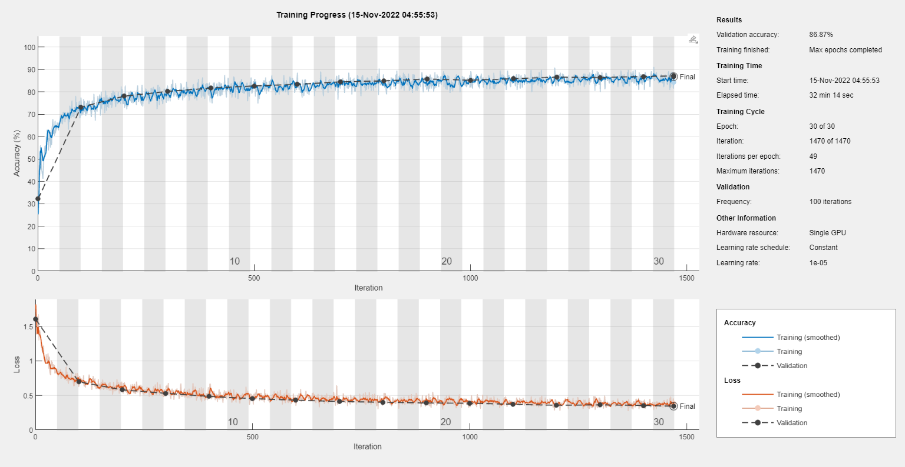
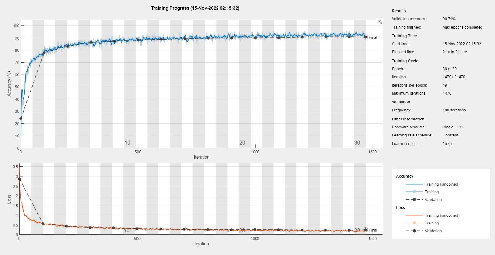
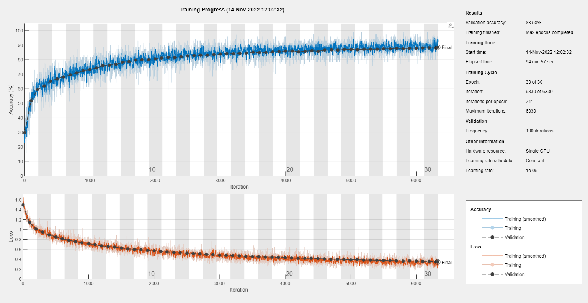
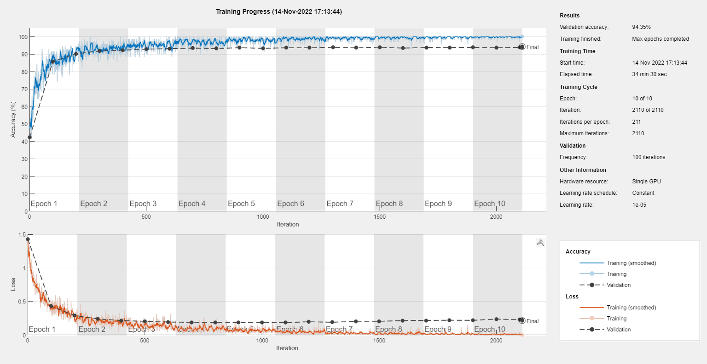
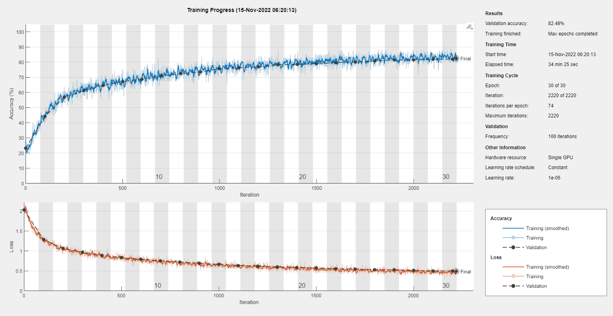
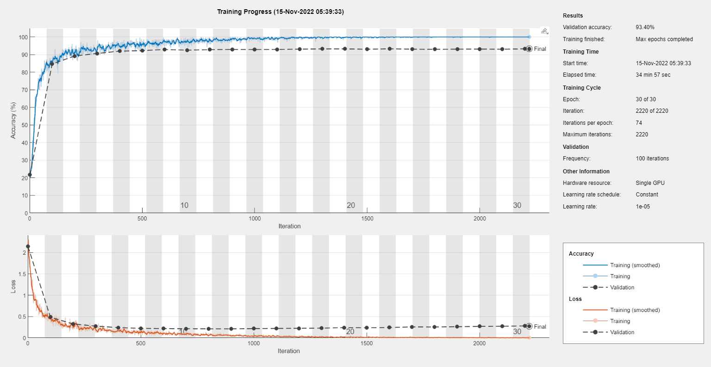

# Appling-transfer-learning-to-SqueezeNet-on-COVID-10-chest-XRAY-dataset
This project focuses on applying transfer learning techniques to the SqueezeNet network for classifying COVID-19 chest X-ray images.
# COVID-19 Chest XRAY Classification using SqueezeNet and Transfer Learning

## Introduction
In this project, we apply transfer learning to the SqueezeNet network on the COVID-19 chest X-ray dataset. The aim is to determine the accuracy of the SqueezeNet network on this dataset. We compare the accuracy of SqueezeNet with ResNet50 and ResNet18 using two optimization algorithms: Stochastic Gradient Descent with Momentum (SGDM) and Adam.

## SqueezeNet
SqueezeNet is a compact and efficient deep learning model that uses "deep compression" techniques to reduce model size while preserving accuracy.

## ResNet50
ResNet50 is a deep neural network architecture commonly used for object recognition and detection. It consists of 50 layers and achieves a top-5 error rate of 3.8% on the ImageNet dataset.

## ResNet18
ResNet18 is a deep neural network architecture designed for object recognition in images. It consists of 18 layers, each dedicated to recognizing specific object features.

## COVID-19 Radiography Database
The COVID-19 Radiography Database contains 21,165 images, including COVID-19 positive cases, Normal cases, Lung Opacity (Non-COVID lung infection) cases, and Viral Pneumonia cases, along with corresponding lung masks.

## Training Phase
Transfer learning is applied to SqueezeNet, ResNet50, and ResNet18 using the COVID-19 Radiography Database. We use two optimization algorithms (SGDM and Adam) with specific training options for each network.

### Training Options

| Deep Neural Network   | Optimization Algorithm | Mini Batch Size | Max Epochs | Initial Learning Rate | Validation Frequency | Verbose | Shuffle | Validation Data |
|-----------------------|------------------------|-----------------|------------|-----------------------|----------------------|---------|---------|-----------------|
| SqueezeNet            | SGDM & Adam            | 300             | 30         | 0.00001               | 100                  | False   | Every-epoch | 30%             |
| ResNet50              | SGDM & Adam            | 70              | 30 (SGDM)  | 0.00001               | 100                  | False   | Every-epoch | 30%             |
| ResNet18              | SGDM & Adam            | 200             | 10 (Adam)  | 0.00001               | 100                  | False   | Every-epoch | 30%             |

## Results

### SqueezeNet
SqueezeNet with SGDM Optimization Algorithm, Epoch: 30

SqueezeNet with Adam Optimization Algorithm, Epoch: 30

### ResNet50
ResNet50 with SGDM Optimization Algorithm, Epoch: 30

ResNet50 with Adam Optimization Algorithm, Epoch: 10

### ResNet18
ResNet18 with SGDM Optimization Algorithm, Epoch: 30

ResNet18 with Adam Optimization Algorithm, Epoch: 30

## Accuracy Results

| Deep Neural Network | Optimization Algorithm | Accuracy   |
|---------------------|------------------------|------------|
| SqueezeNet          | SGDM                   | 86.87%     |
| SqueezeNet          | Adam                   | 90.79%     |
| ResNet50            | SGDM                   | 88.58%     |
| ResNet50            | Adam                   | 94.35%     |
| ResNet18            | SGDM                   | 82.49%     |
| ResNet18            | Adam                   | 93.40%     |
